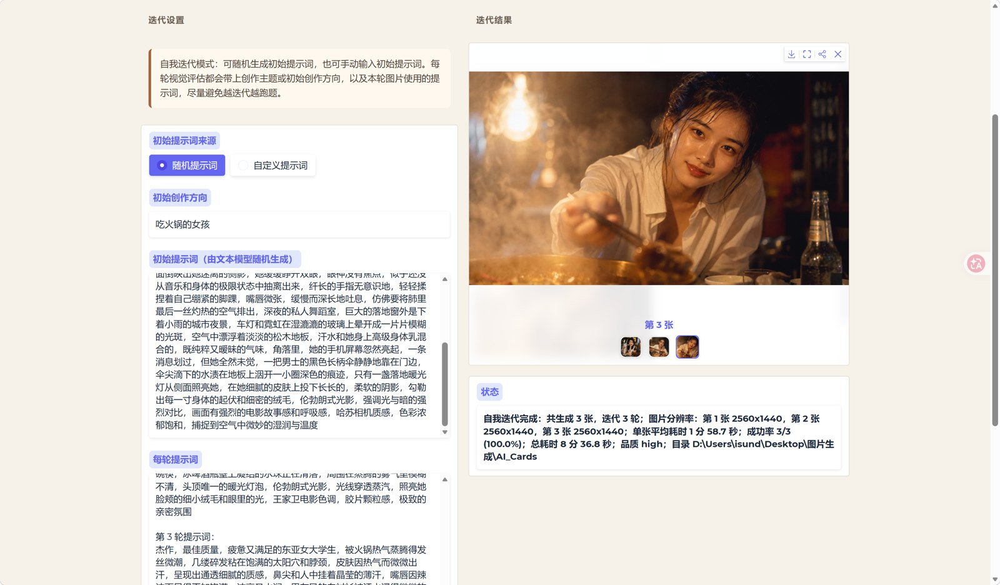

# GPT Image WebStudio

一个面向 GPT Image / OpenAI Images 兼容接口的本地图像生成工作台。它把文生图、图生图、提示词创作、批量出图、随机创意、多轮视觉迭代和图片提示词反推整合在一个 Gradio 界面里，适合需要更细粒度控制图片数量、比例、分辨率和并发流程的用户。

## 为什么做这个工具

很多 API 中转站已经提供了 GPT Image 2 或类似图片生成模型的接口，但常见 AI 聊天软件对图片生成参数的支持并不完整，例如不方便设置生成数量、比例、分辨率，也缺少批量生成、随机生成和自动迭代能力。

这个应用就是为这些场景设计的：通过一个本地可运行的界面，把图片接口、文本模型和多模态模型串起来，让普通用户也可以更灵活地做图像创作实验。

本项目由非程序员用户在 Codex 和 GPT-5.5 的帮助下完成，代码主要由 AI 自动生成。欢迎感兴趣的用户克隆、修改、继续改进。

## 功能亮点

- **手动模式**：输入固定提示词，选择数量、比例和分辨率后批量生成。
- **图生图**：上传参考图并输入编辑提示词，调用图片编辑接口生成新图；大图会先自动压缩上传。
- **随机模式**：调用文本模型生成一段随机提示词，再用这段提示词生成多张图片。
- **创意模式**：同时生成多段不同随机提示词，并以可控并发流水线出图；可开启随机增强，串行避开已用场景。
- **自我迭代模式**：生成图片后调用多模态模型进行视觉评估，自动返回优化提示词进入下一轮；支持最多 10 组并行批量迭代，可开启随机增强避免初始场景重复。
- **提示词反推**：上传图片或填写本地图片路径，由多模态模型反推出中文图像提示词。
- **统一设置页**：集中管理图片生成接口、文本模型接口、多模态模型接口、重试策略、保存目录和提示词模板。
- **Seedream 5.0 支持**：可在设置页单独填写豆包 Seedream 接口，并在出图模式里选择 GPT Image 或豆包 Seedream 5.0 Pro / Lite。
- **生图并发间隔**：为文生图、图生图和批量自我迭代的并发图片请求增加启动间隔，降低中转站限流风险。
- **协议适配**：支持 OpenAI Chat、OpenAI Responses、Gemini 原生协议、Claude Messages。
- **思考档位**：文本模型和多模态模型可以分别设置思考强度，并自动映射到不同厂商的参数。
- **图片压缩**：发送给多模态模型前自动压缩图片，降低上传体积，提高评估速度。
- **错误提示与重试**：接口报错、连接断开、重试状态会显示在状态栏中。

## 界面预览

### 手动模式

输入固定提示词，选择数量、比例、分辨率和并发张数后批量生成。


### 随机模式

由文本模型先生成一段随机提示词，再用这段提示词出图。


### 图生图

上传 1-4 张参考图，输入编辑指令后生成新图片。多图时建议在提示词中写“第一张参考图 / 第二张参考图”，并补充图片特征，识别更稳定。


### 创意模式

并发生成多段不同提示词，并把每段提示词各生成一张图片。


### 自我迭代模式

生成图片后交给多模态模型评估，再返回优化提示词进入下一轮。可以设置生成数量、初始提示词并发数量和图片并发数量；随机提示词模式会为每组生成独立初始提示词，并由“初始提示词并发”限制文本模型调用；自定义提示词模式会直接用同一份用户提示词并行运行多组完整迭代流程，不调用文本模型批量生成初始提示词。



## 新手快速开始

下面以 Windows 为例，不需要写代码。

### 第 1 步：下载项目

打开本项目 GitHub 页面，点击右上方绿色按钮：

```text
Code -> Download ZIP
```

下载完成后，右键解压到一个你容易找到的位置，例如：

```text
D:\gpt-image-webstudio
```

### 第 2 步：安装 Python

如果电脑还没有 Python，去 Python 官网下载安装：

```text
https://www.python.org/downloads/
```

安装时建议勾选：

```text
Add python.exe to PATH
```

安装完成后，按 `Win + R`，输入 `cmd`，打开命令行，输入：

```bash
python --version
```

能看到版本号即可。

### 第 3 步：安装依赖

进入项目文件夹，在地址栏输入 `cmd` 并回车，打开当前目录的命令行。

然后输入：

```bash
pip install -r requirements.txt
```

等待安装完成。

### 第 4 步：启动应用

方式一：双击项目里的：

```text
启动.bat
```

方式二：在命令行输入：

```bash
python app.py
```

启动后会自动打开浏览器。如果没有自动打开，可以查看命令行里的本地地址，通常是：

```text
http://127.0.0.1:7860
```

### 第 5 步：填写接口设置

进入页面后打开“设置”页。

至少需要填写“图片生成接口”：

- API 地址
- 模型 ID
- API Key

如果要使用随机模式或创意模式，还需要填写“文本模型接口”。

如果要使用自我迭代或提示词反推，还需要填写“多模态模型接口”。

填写完成后点击：

```text
保存设置
```

然后回到对应模式开始使用。

### 常见问题

如果刷新页面后设置看起来没有更新，点击“重新读取设置”。

如果启动失败，通常是依赖没有安装成功，可以重新运行：

```bash
pip install -r requirements.txt
```

如果图片接口请求经常断开，可以降低图片并发数量，或者检查代理软件是否影响长连接。

如果中转站对并发较敏感，可以在“设置 -> 重试设置”里调高“生图并发间隔秒”。它控制文生图、图生图和批量自我迭代中图片请求的启动节奏，不等同于失败后的重试间隔。固定批量任务采用完成即补位的有界并发调度，例如生成 20 张、图片并发 5 时，会持续维持最多 5 个运行槽位，不会等待同一批 5 张全部结束后再启动下一批。

## 接口说明

### 图片生成接口

用于实际生成图片和图片编辑。默认使用 OpenAI Images 兼容接口。

建议输入格式：

```text
https://example.com
```

或完整接口：

```text
https://example.com/v1/images/generations
```

图生图会自动把同一地址解析到：

```text
https://example.com/v1/images/edits
```

### Seedream 接口

用于调用火山方舟豆包 Seedream 图片生成接口。进入“设置 -> Seedream 接口”填写：

- 接口格式：`官方方舟` 或 `OpenAI 兼容中转`
- API 地址，例如 `https://ark.cn-beijing.volces.com/api/v3`
- 模型 ID，例如 `doubao-seedream-5-0-pro-260628` 或 `doubao-seedream-5-0-lite-260128`
- API Key
- 返回格式、输出格式和水印选项

在手动、图生图、随机、创意和自我迭代模式中，把“模型选择”切换为“豆包 Seedream”后生效。

`官方方舟`保持原有调用方式：文生图和图生图都通过 JSON 请求 `/api/v3/images/generations`，参考图以 data URL 传入。

`OpenAI 兼容中转`复用 GPT Image 的接口路径：文生图使用 `/v1/images/generations`，图生图使用 multipart `/v1/images/edits`。中转站 API 地址可以填写域名根地址（例如 `https://api.example.com`）、`/v1` 地址或完整接口地址。该模式继续使用 Seedream 的模型 ID、尺寸映射和水印设置，但不会发送 GPT 专属的 `moderation`、`quality` 或 `input_fidelity` 参数。

Seedream 的尺寸规则和 GPT Image 独立处理：程序会直接根据模型 ID 自动识别 Pro/Lite，不再单独维护“模型版本”字段。

推荐模型 ID：

```text
doubao-seedream-5-0-pro-260628
doubao-seedream-5-0-lite-260128
```

`doubao-seedream-5-0-260128` 会被视为 Lite 模型的同名兼容 ID。程序会把当前“图片比例 + 分辨率”转换成固定宽高像素值传给接口，而不是传 `1K/2K/3K/4K` 档位让模型自行判断。Lite 使用官方 size string 表中的固定像素值；Pro 的显式宽高需要额外满足总像素不超过 `2048x2048` 的接口校验，因此宽屏/竖屏 2K 会使用合法的 `2560x1440` / `1440x2560`。

### 文本模型接口

用于随机提示词生成和创意模式提示词生成。

支持：

- OpenAI Chat Completions
- OpenAI Responses
- Gemini 原生协议
- Claude Messages

### 多模态模型接口

用于自我迭代视觉评估和提示词反推。

支持：

- OpenAI Chat Completions
- OpenAI Responses
- Gemini 原生协议
- Claude Messages

## 思考档位

文本模型和多模态模型都可以单独设置：

```text
关闭 / 低 / 中 / 高 / 最高
```

程序会根据协议自动映射：

- OpenAI Chat：`reasoning_effort`
- OpenAI Responses：`reasoning.effort`
- Gemini：`thinkingConfig`
- Claude：`thinking` 或 adaptive thinking

如果某个接口不支持思考参数，选择“关闭”即可。

## 图片压缩

自我迭代和提示词反推会在发送图片给多模态模型前创建一份内存中的压缩 JPEG：

- 不影响本地保存的原图
- 默认长边限制为 1536px
- 默认 JPEG 质量为 90

这样可以明显减少多模态请求体积。

图生图上传的参考图如果单张大于 2.5MB，也会先创建一份压缩后的上传副本，不影响本地原图。

## 控制台运行日志

应用默认在启动窗口输出结构化运行日志，包括模式启动、文本和多模态任务、图片请求、并发池补位、保存路径、耗时、重试与失败原因。日志不会输出 API Key 或完整提示词。

```text
2026-07-13 16:20:18 | INFO    | [创意模式] 任务启动 | images=5 | text_concurrency=2 | image_concurrency=3
2026-07-13 16:20:20 | INFO    | [图片生成] 准备请求 | provider=豆包 Seedream | model=doubao-seedream-5-0-pro-260628 | size=2560x1440
2026-07-13 16:21:03 | INFO    | [请求] 完成 | operation=图片生成 | attempt=1 | elapsed=43.1 秒
```

默认日志等级为 `INFO`。需要查看更细的请求尝试信息时，可以在 `.env` 中增加：

```text
WEBSTUDIO_LOG_LEVEL=DEBUG
```

可用等级为 `DEBUG`、`INFO`、`WARNING`、`ERROR`。

## 配置文件

程序首次启动或保存设置后，会使用这些本地文件：

```text
app_config.json
.env
prompt_templates.py
```

`app_config.json` 用于保存页面状态、保存目录和重试设置，不保存接口密钥或真实提示词。接口地址、模型 ID 和 API Key 会保存到同目录的 `.env`。真实提示词模板保存在 `prompt_templates.py`。

如果 `app_config.json` 或 `.env` 不存在，程序会自动创建一份空配置。如果 `prompt_templates.py` 不存在，程序会从 `prompt_templates_Default.py` 复制一份默认模板。这样公开版本可以提交默认模板，个人版本只需要保留自己的 `.env` 和 `prompt_templates.py`，这些本地文件默认不会进入 Git。

提示词模板支持变量，例如 `{{date}}`、`{{time}}`、`{{datetime}}`、`{{preference}}`、`{{used_scenes}}`。随机增强的场景概述模板支持 `{{prompt}}`。自我迭代的视觉提示词还支持 `{{current_prompt}}`、`{{creation_theme}}`、`{{user_initial_direction}}`、`{{image}}`。

可以参考：

```text
app_config.example.json
```

## 目录说明

```text
app.py                    兼容启动入口
webstudio/config.py       环境变量、提示词模板、配置状态与停止标记
webstudio/core.py         尺寸、协议、响应解析、错误和媒体预处理
webstudio/runtime.py      重试、有界并发池与请求启动间隔
webstudio/text_tasks.py   文本模型与多模态任务层
webstudio/image_tasks.py  图片请求、保存和批量图片任务层
webstudio/workflows/      手动、图生图、随机、创意、自我迭代和反推工作流
webstudio/settings.py     设置保存与页面状态加载
webstudio/ui.py           Gradio 页面构建、样式与事件绑定
config_store.py           配置读写工具
env_loader.py             本地 .env 和提示词模板初始化
prompt_templates_Default.py 公开默认提示词模板
requirements.txt          Python 依赖
DEPENDENCIES.md           依赖说明
app_config.example.json   配置示例
gpt_image_webstudio.ico   Windows 图标
启动.bat                  Windows 启动脚本
```

## 参与改进

欢迎提交 issue、建议或改进版本。可以继续扩展的方向包括：

- 更多图片生成协议
- 更细的任务队列管理
- 更灵活的提示词模板系统
- 更强的批量结果筛选和收藏
- 多模型对比生成
